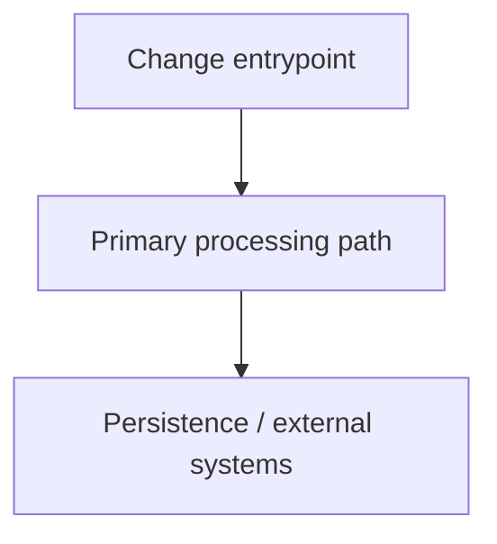

# Rip Task

Take a task brief and execute through implementation and PR creation.

## Input

- A task description and optional branch slug.

### Step 1: Read the task

Use the user-provided task title/description as scope.

If no branch name is provided, generate: `<slugified-title>`.

### Step 2: Create branch

```bash
git checkout main
git pull origin main
git checkout -b <branch-name>
```

### Step 3: Implement

Use the task description as scope.

### Step 4: Commit

- Stage relevant files
- Commit message format: `feat|fix|chore(<short-scope>): <short summary>`
  (conventional commit format)

### Step 5: Push and open PR

```bash
git push -u origin <branch-name>
```

If a PR template exists, apply it first and then append the generated summary block after the template body.

Use available PR template if present, then open PR with PR title matching commit title.

```bash
# Determine PR template path
for template in ".github/pull_request_template.md" ".github/PULL_REQUEST_TEMPLATE.md" ".github/PULL_REQUEST_TEMPLATE/*.md"; do
  [ -f "$template" ] && PR_TEMPLATE="$template" && break
done

# Start PR body with template content when present, then append summary
if [ -n "${PR_TEMPLATE:-}" ]; then
  cat "$PR_TEMPLATE" > /tmp/pr-body.md
else
  : > /tmp/pr-body.md
fi

cat <<'EOF_MD' >> /tmp/pr-body.md

## Summary
- Implemented ...
- Tests/validation: ...

## Architecture (Core Change)

EOF_MD
```

Choose one PR label:

- `bug`
- `enhancement`
- `documentation`

Default to `enhancement`.

### Step 6: Return to main

```bash
git checkout main
```

## Mermaid guideline

- Generate the Mermaid diagram only when there is a meaningful architectural change (new module interactions, flow, or integration path).
- Keep it high-level: focus on changed components, interfaces, and major data flow.
- For single-file tweaks, skip the diagram and note "Mermaid not applicable".

## Rules

- Commit and PR titles should match.
- Return to `main` at the end.
- Run lint/tests before commit when possible.
