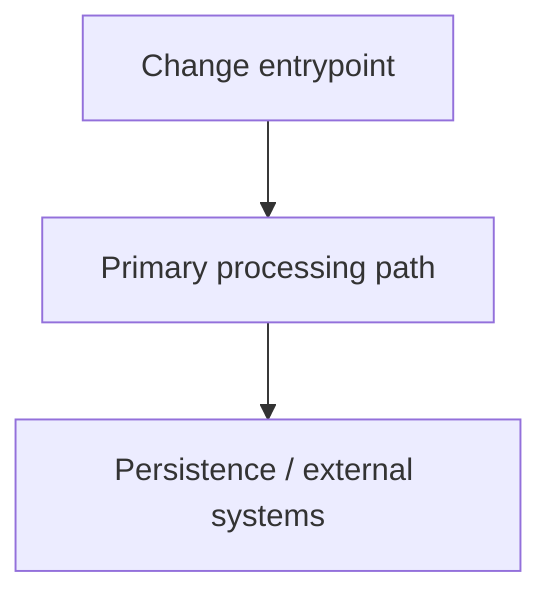

# Ship Issue

Take a Linear issue ID and execute through implementation and PR creation.

## Input

A Linear issue identifier such as `ML-123`.

### Step 1: Read the issue

Fetch issue details, especially title, description, and branch name.

### Step 2: Create branch

```bash
git checkout main
git pull origin main
git checkout -b <branch-name-from-linear>
```

If no branch name exists, generate: `<issue-id-lowercase>/<slugified-title>`.

### Step 3: Implement

Use the issue description as scope.

### Step 4: Commit

- Stage relevant files
- Commit message format: `[<ISSUE-ID>] <Issue Title>`

### Step 5: Push and open PR

```bash
git push -u origin <branch-name>
```

If a PR template exists, apply it first and then append the generated summary block after the template body.

Use available PR template if present, then open PR with PR title matching commit title.

```bash
# Determine PR template path
for template in ".github/pull_request_template.md" ".github/PULL_REQUEST_TEMPLATE.md" ".github/PULL_REQUEST_TEMPLATE/*.md"; do
  [ -f "$template" ] && PR_TEMPLATE="$template" && break
done

# Start PR body with template content when present, then append summary
if [ -n "${PR_TEMPLATE:-}" ]; then
  cat "$PR_TEMPLATE" > /tmp/pr-body.md
else
  : > /tmp/pr-body.md
fi

cat <<'EOF' >> /tmp/pr-body.md

## Summary
- Implemented ...
- Tests/validation: ...

## Architecture (Core Change)

EOF
```

Choose one PR label:

- `bug`
- `enhancement`
- `documentation`

Default to `enhancement`.

### Step 6: Return to main

```bash
git checkout main
```

### Step 7: Update issue state

Move the Linear issue to review state if available.

## Mermaid guideline

- Generate the Mermaid diagram only when there is a meaningful architectural change (new module interactions, flow, or integration path).
- Keep it high-level: focus on changed components, interfaces, and major data flow.
- For single-file tweaks, skip the diagram and note "Mermaid not applicable".

## Rules

- Commit and PR titles should match.
- Return to `main` at the end.
- Run lint/tests before commit when possible.
