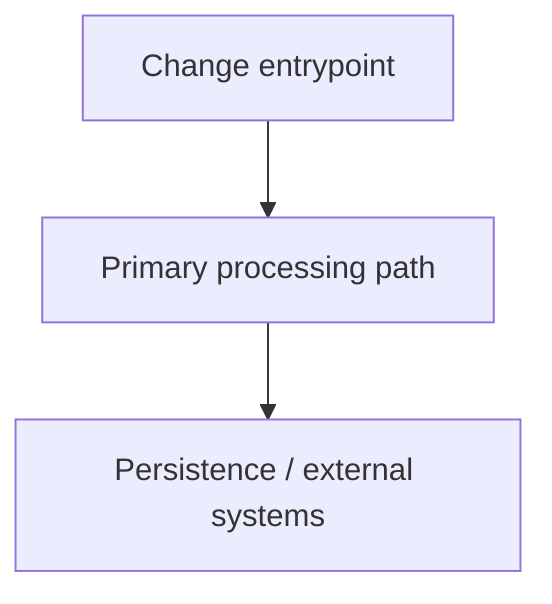

# Ship Issue

Take a Linear issue input and execute through implementation and PR creation.

## Input

- Required: Linear issue identifier like `ML-123`.
- Optional mode token: `linear`.

Interpret input as:

- `ML-123 linear` -> `linear-mode`
- `ML-123` -> `conventional-mode`

Both modes always start from a Linear issue lookup.

### Step 1: Read the issue

Fetch issue details: title, description, and branch name from Linear.

If no branch name exists, generate fallback: `<issue-id-lowercase>/<slugified-title>`.

### Step 2: Resolve mode, branch, and commit title

If `linear-mode`:

- Branch name: use Linear branch name as-is.
- Commit/PR title: `[<ISSUE-ID>] <Issue Title>`.

If `conventional-mode`:

- Start from Linear branch name (or fallback branch).
- Remove the issue token from the branch name.

Normalize using these rules:

- Strip leading `ml-<number>/`
- Strip leading `ml-<number>-`
- Strip `/ml-<number>-` from prefixed branches

Examples:

- `ml-123/feature-refactor` -> `feature-refactor`
- `ml-123-feature-refactor` -> `feature-refactor`
- `feature/ml-123-refactor` -> `feature/refactor`

Build first commit/PR title as conventional commit:

- `feat|fix|chore(<short-scope>): <short summary>`
- `short-scope` should come from stripped branch scope.

### Step 3: Create branch

```bash
git checkout main
git pull origin main
git checkout -b <resolved-branch-name>
```

### Step 4: Implement

Use the issue description as scope.

### Step 5: Commit

- Stage relevant files.
- Use the resolved commit title format from Step 2.
- In `conventional-mode`, ensure the first commit is conventional commit format.

### Step 6: Push and open PR

```bash
git push -u origin <branch-name>
```

If a PR template exists, apply it first and then append the generated summary block after the template body.

Use available PR template if present, then open PR with PR title matching the commit title.

```bash
# Determine PR template path
for template in ".github/pull_request_template.md" ".github/PULL_REQUEST_TEMPLATE.md" ".github/PULL_REQUEST_TEMPLATE/*.md"; do
  [ -f "$template" ] && PR_TEMPLATE="$template" && break
done

# Start PR body with template content when present, then append summary
if [ -n "${PR_TEMPLATE:-}" ]; then
  cat "$PR_TEMPLATE" > /tmp/pr-body.md
else
  : > /tmp/pr-body.md
fi

cat <<'EOF' >> /tmp/pr-body.md

## Summary
- Implemented ...
- Tests/validation: ...

## Architecture (Core Change)

```mermaid
flowchart TD
  A[Change entrypoint] --> B[Primary processing path]
  B --> C[Persistence / external systems]
```
EOF
```

Choose one PR label:

- `bug`
- `enhancement`
- `documentation`

Default to `enhancement`.

### Step 7: Return to main

```bash
git checkout main
```

### Step 8: Update issue state

Move the Linear issue to `In Review` after PR creation.

## Mermaid guideline

- Generate the Mermaid diagram only when there is a meaningful architectural change (new module interactions, flow, or integration path).
- Keep it high-level: focus on changed components, interfaces, and major data flow.
- For single-file tweaks, skip the diagram and note "Mermaid not applicable".

## Rules

- Commit and PR titles should match.
- Return to `main` at the end.
- Always move the issue to `In Review` in both modes.
- Run lint/tests before commit when possible.
